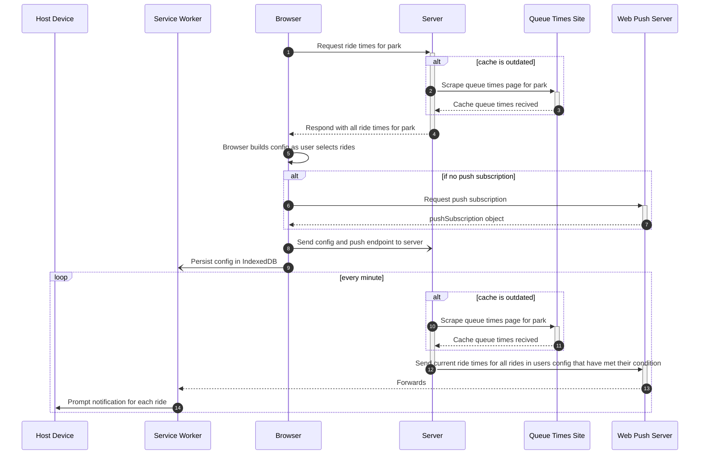

# Architecture

Sequence of client building a config to receiving a notification:

```mermaid
sequenceDiagram
autonumber

    participant H as Host Device
    participant SW as Service Worker
    participant B as Browser
    participant S as Server
    participant QT as Queue Times Site
    participant WP as Web Push Server

    B->>+S: Request ride times for park
    alt cache is outdated
        S->>+QT: Scrape queue times page for park
        QT-->>-S: Cache queue times recived
    end
    S-->>-B: Respond with all ride times for park
    B->>B: Browser builds config as user selects rides 
    alt if no push subscription
        B->>+WP: Request push subscription
        WP-->>-B: pushSubscription object
    end
    B-)S: Send config and push endpoint to server
    B-)SW: Persist config in IndexedDB

    loop every minute
        alt cache is outdated
        S->>+QT: Scrape queue times page for park
        activate S
        QT-->>-S: Cache queue times recived
        end
        S->>+WP: Send current ride times for all rides in users config that have met their condition
        deactivate S
        WP-->>-SW: Forwards
        SW->>H: Prompt notification for each ride
    end
```