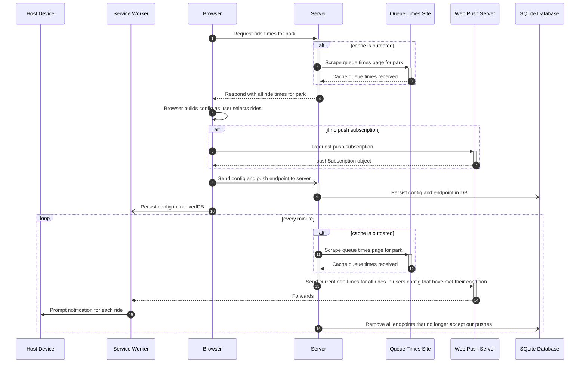

# Architecture

Sequence of client building a config to receiving a notification:

## Endpoints

- `/userCount`
  - Get: Returns a body containing the current number of active users
- `/vapidPublicKey`
  - Get: Returns a body containing a base64 encoded public key for VAPID encrypting push notifications
- `/register`
  - Post: Takes JSON containing a pushSubscription and Queue Alert config and registers that push endpoint as a unique user, or updates that endpoints config if that endpoint is already registered. This endpoint will receive notifications derived from its associated config until unregistered.
- `/unregister`
  - Post: Takes JSON containing a pushSubscription, and removes that endpoint and its configuration from the server.
- `/allParks`
  - Get: Returns JSON mapping park names to queue times urls
- `/parkWaitTimes?url={}`
  - Get: Responds with a sorted JSON array of ride wait times for the url in the url query parameter. 